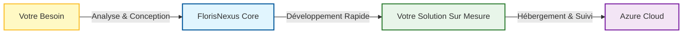
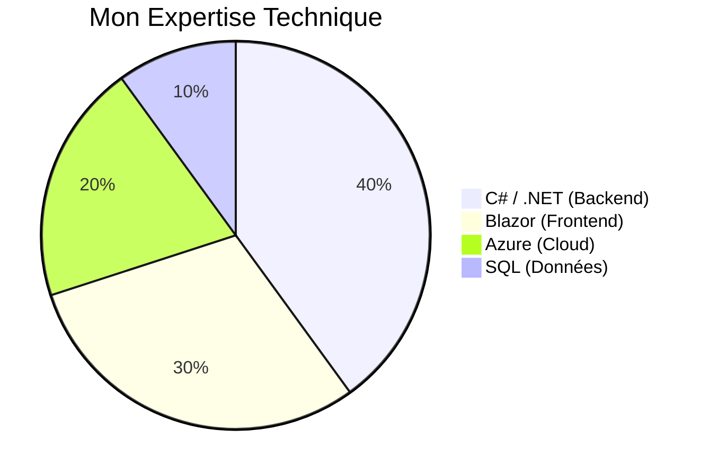

# 🪐 FlorisNexus
> **Solutions Numériques Haute Performance pour Indépendants & Artisans.**

 

**FlorisNexus** est mon entreprise de développement logiciel freelance.  
Je transforme vos besoins métiers en solutions numériques robustes, rapides et évolutives. Mon objectif est d'apporter la qualité logicielle des grandes entreprises aux artisans, indépendants et PME.

---

## 🚀 Ma Mission

J'accompagne les professionnels dans leur transformation numérique à travers trois axes principaux :

| Service | Description |
| :--- | :--- |
| **🏢 Applications Métier & SaaS** | Développement de logiciels sur mesure (ERP, CRM, Gestion de stocks) pour automatiser votre activité. |
| **✨ Sites Vitrines Premium** | Création de sites web ultra-rapides, modernes et optimisés pour le référencement (SEO). |
| **🛠️ Outils & Automatisation** | Scripts et outils internes pour gagner du temps sur vos tâches répétitives. |

---

## � L'Approche FlorisNexus

Je ne pars jamais de zéro. Pour garantir **rapidité** et **fiabilité**, je m'appuie sur mon propre socle technique interne : le **FlorisNexus Core Engine**.

Cela me permet de vous livrer des projets avec des standards de qualité industrielle dès le premier jour :

*   ✅ **Clean Architecture** : Code maintenable et évolutif.
*   ✅ **Sécurité** : Authentification et protection des données incluses.
*   ✅ **Performance** : Temps de chargement optimisés.
*   ✅ **Hébergement Cloud** : Déploiement professionnel sur Microsoft Azure.

---

## 🛠 Expertise Technique

Je suis spécialisé dans l'écosystème Microsoft, reconnu pour sa stabilité et sa performance en entreprise.

### Technologies Maîtrisées

*   **Backend** :  
*   **Frontend** :  
*   **Cloud & DevOps** :  
*   **Data** :  

---

## � Travailler avec moi

Vous avez un projet ? Une idée ? Discutons-en.

### **FlorisNexus**
*L'excellence technique au service de votre métier.*

**Fondateur** : Floris  
**Localisation** : Freelance (Disponible en Remote)

[🌐 Visiter le site (Bientôt disponible)](https://florisnexus.com)  
[✉️ Me contacter](mailto:contact@florisnexus.com)

