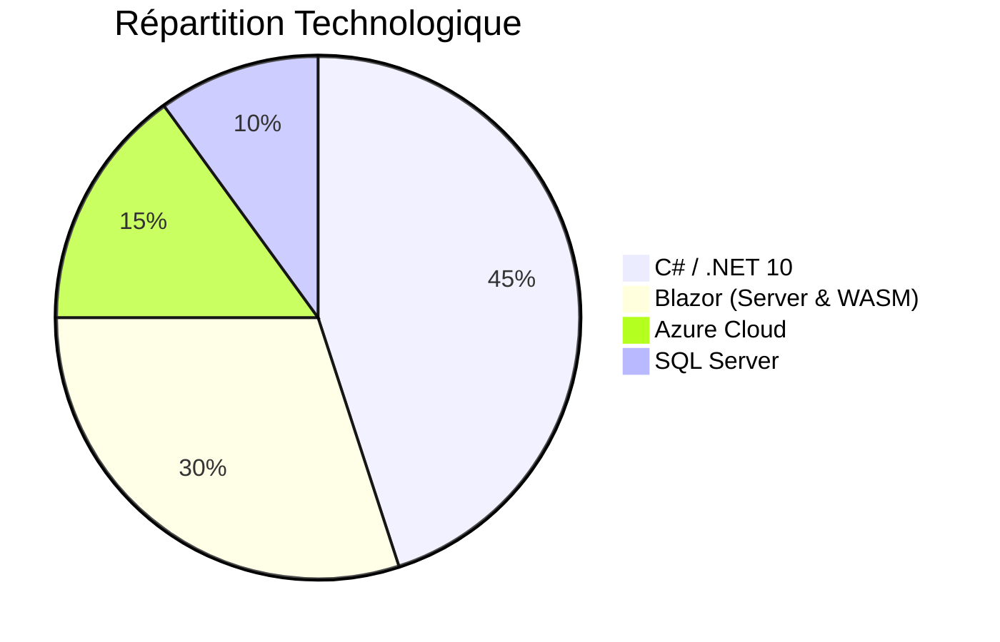

# 🪐 FlorisNexus Core Engine

  

> **Le socle technique haute performance pour indépendants et artisans.**

**FlorisNexus Core** est le repository de référence (*boilerplate*) utilisé pour propulser les solutions numériques de mes clients. Ce projet centralise les meilleures pratiques en **.NET 10**, **Blazor** et **Clean Architecture** afin de garantir **rapidité de déploiement**, **robustesse** et **scalabilité**.

---

## 🚀 Vision du projet

L’objectif de ce repository est de fournir une structure **Ready-to-Market** pour :

| Type de Projet | Description |
| :--- | :--- |
| **🏢 SaaS métier** | Gestion de stocks, plannings, facturation spécialisée, outils sectoriels. |
| **✨ Sites vitrines** | Expériences web modernes, performantes et optimisées pour le SEO. |
| **🛠️ Outils internes** | Automatisation de processus et applications internes pour artisans et indépendants. |

---

## 🛠 Tech Stack



| Composant | Technologie |
| :--- | :--- |
| **Framework** |  |
| **Frontend** |  |
| **Langage** |  |
| **Base de données** |  |
| **ORM** | Entity Framework Core |
| **Cloud** |  |
| **UI / UX** | Tailwind CSS / MudBlazor |

---

## 🏗 Architecture

Le projet suit les principes de la **Clean Architecture** pour une séparation claire des responsabilités.

```mermaid
graph TD
    subgraph Presentation ["🖥️ Presentation Layer"]
        Web[FlorisNexus.Web\n(Blazor UI)]
    end

    subgraph Core ["🧠 Core Layer"]
        App[FlorisNexus.Application\n(Use Cases & Interfaces)]
        Domain[FlorisNexus.Domain\n(Entités & Règles Métier)]
    end

    subgraph Infrastructure ["🏗️ Infrastructure Layer"]
        Infra[FlorisNexus.Infrastructure\n(EF Core, APIs Externes)]
        DB[(SQL Server)]
    end

    Web -->|Utilise| App
    Infra -->|Implémente| App
    App -->|Définit| Domain
    Infra -->|Persiste| DB

    style Web fill:#e1f5fe,stroke:#01579b,stroke-width:2px
    style App fill:#fff9c4,stroke:#fbc02d,stroke-width:2px
    style Domain fill:#e8f5e9,stroke:#2e7d32,stroke-width:2px
    style Infra fill:#f3e5f5,stroke:#7b1fa2,stroke-width:2px
```

- **`FlorisNexus.Domain`** : Cœur du métier, indépendant de tout framework.
- **`FlorisNexus.Application`** : Orchestration, DTOs, et logique applicative.
- **`FlorisNexus.Infrastructure`** : Implémentation technique (Base de données, Emails, etc.).
- **`FlorisNexus.Web`** : Interface utilisateur réactive.

---

## ✨ Fonctionnalités (Core Features)

- [x] **🔐 Authentication & Authorization** : ASP.NET Core Identity préconfiguré.
- [x] **🎨 UI Kit** : Composants réutilisables pour formulaires et tableaux de bord.
- [x] **🌍 Multilingue (i18n)** : Support prêt pour les marchés locaux et internationaux.
- [x] **📜 Audit Logging** : Traçabilité des actions pour conformité et debugging.
- [x] **🚀 CI / CD** : Workflows GitHub Actions pour build et déploiement Azure.
- [x] **🔍 SEO Engine** : Gestion dynamique des Meta Tags pour les sites vitrines.

---

## ⚙️ Installation rapide

### 1. Cloner le projet

```bash
git clone https://github.com/votre-compte/florisnexus-core.git
cd florisnexus-core
```

### 2. Configurer la base de données

Mettre à jour la chaîne de connexion dans `appsettings.json` ou utiliser les **User Secrets** (recommandé en local) :

```json
{
  "ConnectionStrings": {
    "DefaultConnection": "Server=(localdb)\\mssqllocaldb;Database=FlorisNexusDb;Trusted_Connection=True;"
  }
}
```

### 3. Appliquer les migrations

```bash
dotnet ef database update \
  --project FlorisNexus.Infrastructure \
  --startup-project FlorisNexus.Web
```

### 4. Lancer l’application

```bash
dotnet run --project FlorisNexus.Web
```

---

## 📈 Gestion de l’entreprise

> *Laboratoire technique pour tester et valider l'optimisation et la scalabilité.*

- **💰 Optimisation des coûts** : Azure Free / B1 tiers.
- **💳 Monétisation** : Intégration de modules de paiement (Stripe, PayPal).
- **📊 Reporting** : Génération automatisée de rapports pour une comptabilité simplifiée.

---

## 📞 Contact & Support

<div align="center">

### **FlorisNexus**
*Développeur de solutions sur mesure pour ceux qui créent.*

**Fondateur** : Floris  
**Expertise** : .NET · Azure · SaaS Strategy

[🌐 Website (En cours)](https://florisnexus.com)

</div>