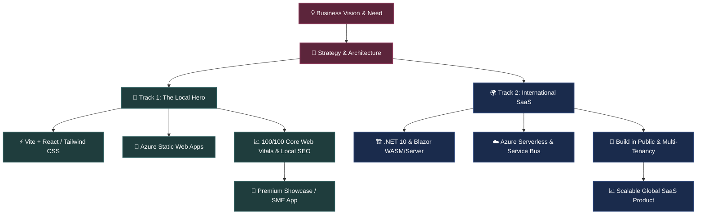

# 🪐 FlorisNexus
> **High-Performance Digital Engineering for Local Experts & Global Platforms.**

Welcome! I am **Florian**, the software architect behind **FlorisNexus**. I operate at the intersection of artisanal code crafting and high-scale cloud software, delivering elite digital products through a strategic dual-track framework.

---

## 🛠️ The Dual-Track Strategy

I divide my engineering focus into two dedicated tracks, ensuring tailored excellence whether serving local business communities or scaling software globally.

```mermaid
graph TD
    Need["💡 Business Vision & Need"] --> Align["🤝 Strategy & Architecture"]
    
    Align --> Track1["🏡 Track 1: The Local Hero"]
    Align --> Track2["🌍 Track 2: International SaaS"]
    
    Track1 --> Dev1["⚡ Vite + React / Tailwind CSS"]
    Track1 --> SWA["🚀 Azure Static Web Apps"]
    Track1 --> SEO["📈 100/100 Core Web Vitals & Local SEO"]
    
    Track2 --> Dev2["🏗️ .NET 10 & Blazor WASM/Server"]
    Track2 --> Cloud["☁️ Azure Serverless & Service Bus"]
    Track2 --> Public["📢 Build in Public & Multi-Tenancy"]
    
    SEO --> Deliver1["💎 Premium Showcase / SME App"]
    Public --> Deliver2["📈 Scalable Global SaaS Product"]

    classDef local fill:#1f3d3d,stroke:#2e5c5c,stroke-width:2px,color:#fff;
    classDef saas fill:#1a2b4c,stroke:#2a4478,stroke-width:2px,color:#fff;
    classDef core fill:#5c253b,stroke:#8f3a5c,stroke-width:2px,color:#fff;

    class Need core;
    class Align core;
    class Track1 local;
    class Dev1 local;
    class SWA local;
    class SEO local;
    class Deliver1 local;
    class Track2 saas;
    class Dev2 saas;
    class Cloud saas;
    class Public saas;
    class Deliver2 saas;
```

### 🏡 Track 1: The Local Hero (Local Digital Presence)
I design ultra-fast, premium web experiences and custom management tools for local artisans, SMEs, and professionals.
*   **Focus:** Blazing-fast loading speeds, bespoke visual design, pixel-perfect responsiveness, and local SEO dominance.
*   **Tech Stack:** React, TypeScript, Tailwind CSS, Vite, Azure Static Web Apps.
*   **Performance Target:** $\ge$ 95+ Mobile Lighthouse scores & tailored structured schema data.
*   **Featured Projects:** 
    *   **FlorisNexus Agency** — Agency landing page optimized for local client acquisition. | [florisnexus.com](https://florisnexus.com)
    *   **KiDoKaï** — Showcase site for a local martial arts club. | [kidokai.be](https://kidokai.be)
    *   **NordicHorizons** — Modern booking and shuttle showcase portal. | [nordichorizons.ca](https://nordichorizons.ca)

### 🌍 Track 2: International SaaS (Global Tech Infrastructure)
I architect and build enterprise-grade, multi-tenant B2B/B2C SaaS products engineered for high concurrency and cloud scalability.
*   **Focus:** Solid database isolation, Event-Driven Architecture, secure Managed Identities, and automated Bicep infrastructures.
*   **Tech Stack:** .NET 10, Blazor Server/WASM, Azure App Services, Functions, Service Bus, SQL Server, and .NET Aspire.
*   **Philosophy:** **Build in Public** with technical transparency and clean architecture.
*   **Featured Projects:**
    *   **Continuum** — Real-time API monitoring and alerting platform. | [continuumnexus.com](https://continuumnexus.com)
    *   **3Smiles** — Multi-tenant restaurant menu management and real-time staff dispatcher.

---

## 💎 My Engineering Commitments

*   ⚡ **Zero-Compromise Performance**: Fast interfaces keep users engaged and search engines happy.
*   🔒 **Security by Design**: Complete tenant isolation, managed identities, and secure credentials management.
*   🪵 **Clean & Documented Code**: Adherence to the *One Class per File* principle, strict architectural patterns, and XML documentation.
*   🚢 **Robust Automation**: Full CI/CD pipelines split across app compilation, infra provisioning, and configuration synchronization.

---

## 📬 Let's Connect
Looking to establish a stellar local presence, or need a robust cloud-native architecture for your next SaaS?

*   💼 **Freelance Inquiries**: florian.divrusa@florisnexus.com
*   🌐 **Website**: [florisnexus.com](https://florisnexus.com)
*   💻 **GitHub**: [@FlorisNexus](https://github.com/FlorisNexus)
